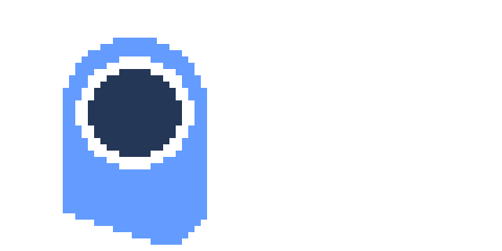

# naut
### Thanks for coming

## Huh?
naut is an [open source](https://en.wikipedia.org/wiki/GNU_General_Public_License) social media that REALLY tries to do it's best and bring THE experience.  
here the rules are different, the most exiting part of the project is to hear the users and take action to improve in any aspect.
at any time.    
the source code could be rewritten at ANYTIME, there will be breaking changes !!11

## Design is Everything 
One of the most interesting parts is that naut somehow feels alive.  
all theming decisions made it's own personality (and i think is fun to watch)

## In Progress
There is plenty to do, so lil me will be greatful if ol' you pull request anything smileyface.
